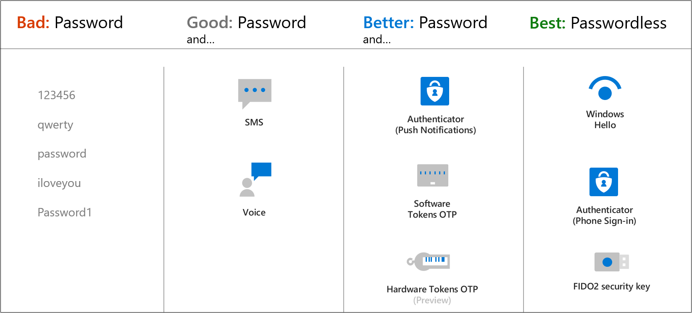

# Configure authentication methods

[Configure authentication methods including password hash and Pass Through Authentication (PTA), OAuth and passwordless](https://docs.microsoft.com/en-us/azure/active-directory/authentication/concept-authentication-methods)

* OAuth
   * Open standard that specifies how time-based one-time-passwords are generated
   * Hardware or Software (For example MS Authenticator)
   * OATH TOTP hardware tokens typically come with a secret key, preprogrammed in the token, which must be input into Azure AD. The hardware token does a refresh of the code every 30 or 60 seconds.
* Passwordless (most secure)
   * Windows Hello for Business
   * Microsoft Authenticator app
   * FIDO2 security keys (FIDO = "Fast IDentity Online"), and allows users to sign in with external hardware key over Bluetooth, NFC, Lightning or USB.

## Azure Ad Connect

[What is Azure AD Connect?](https://docs.microsoft.com/en-us/azure/active-directory/hybrid/whatis-azure-ad-connect)

* Azure AD Connect is required for all hybrid authentication methods
* Using Azure AD Connect is free.
* Use the Synchronization Rules Editor to control which users are synced with Azure AD.

## Authentication in hybrid scenarios

[Choose the right authentication method for your Azure Active Directory hybrid identity solution](https://docs.microsoft.com/en-us/azure/security/fundamentals/choose-ad-authn)

### Pass Through Authentication (PTA)
[Pass through authentication](https://docs.microsoft.com/en-us/azure/active-directory/hybrid/how-to-connect-pta-how-it-works)
* Used to delegate authentication to on-site AD
   * On site password policies and sign-in hours are enforced using this authentication method
* Supports Account Disabling, Account lockout, Account expiration, Password expiration and Logon hours
* Requires more hardware than Password hash synchronization

### Password hash synchronization (PHS)
[Password hash synchronization](https://docs.microsoft.com/en-us/azure/active-directory/hybrid/whatis-phs)
* Passwords are maintained in on-site AD, and a password hash is synchronized to Azure to enable sign in to Azure with on-site domain credentials
* Enables Leaked credential detection (with Azure AD Premium P2): User account will be tag'ed as "High risk" account if the username and password is found in a breach
* Supports only Account Disabling (not Account lockout, Account expiration, Password expiration or Logon hours)

### ADFS federation
* Ensures user authentication happens on-site: Passwords are not synced to Azure
* Lots of features, including smart card authentication

[Return to Manage identity and access](README.md)

[Return to Table of Contents](../README.md)