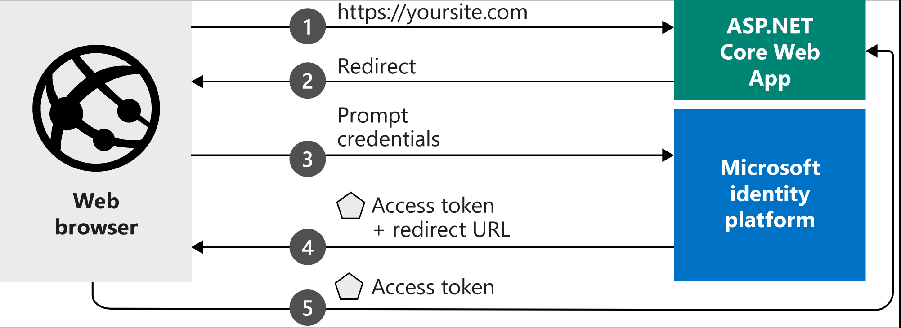

# Create App registration

* Register apps to enable authentication and authorization using Azure / Microsoft logins.
* Register the app under Active Directory -> New registration

## High level registration process for a web application

1. Add a Display Name for your app
2. Add users (sign-in audience)
3. Enable the app, so that end users can see it: Enterprise Applications -> app -> Properties -> Visible to Users -> Yes
4. Add the Redirect URI to the application under Platform Settings in the Azure portal, so that the Identity Platform knows where to redirect unauthenticated users

## Confidential applications

[Confidential applications](https://docs.microsoft.com/en-us/azure/active-directory/develop/msal-client-applications)

* An application that doesn't authenticate using the end users credentials, for example a daemon, or a web application that's not exposed to the internet.
* If a confidential application needs to access for example an API, configure it to authenticate using either
   * Certificate (recommended)
   * Client secrets

[Return to Manage identity and access](README.md)

[Return to Table of Contents](../README.md)