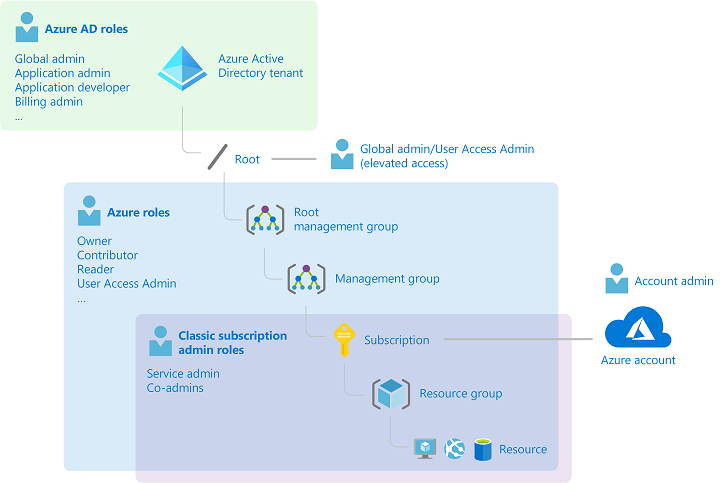

# Identify the appropriate role

Figure: Classic roles, RBAC roles and AD roles

* Role: A collection of actions that the assigned identity can perform. Action examples: "Create disk". "Scale DB".
* A role answers the question: "**What** can be done"

## Classic subscription roles
The classic subscription roles are legacy, and should be avoided.

## Azure AD roles

Apply least privileges principle: [Video reference](https://techcommunity.microsoft.com/t5/video-hub/get-to-least-privilege-in-azure-active-directory-and-microsoft/m-p/1698823)
* Reduce number of global admins
   * Break down organization into [Administrative units](14-Manage%20administrative%20units.md), and scope down admnistrators to an administrative unit.
* Enable users to administer with least possible privilege
   * Use [PIM]((21-Monitor%20privileged%20access%20for%20Azure%20AD%20Privileged%20Identity%20Management%20(PIM).md)) to put a time limit on the admin privileges, and to approve and monitor admin operations
* Assign roles to groups instead of assigning directly to users

[Azure AD roles reference](https://docs.microsoft.com/en-us/azure/active-directory/roles/permissions-reference)

* Global administrator
   * Only one who can set up [password writeback](15-Configure%20password%20writeback.md)
* Privileged role administrator
   * Can set up [Administrative units](14-Manage%20administrative%20units.md)
* User administrator
* Application developer
* Billing administrator
* ... and many more

## Azure roles, aka Azure resource roles

Apply least privileges principle: [Reference](https://docs.microsoft.com/en-us/azure/security/fundamentals/identity-management-best-practices#use-role-based-access-control)
* Segregate duties within your team and grant only the amount of access to users that they need to perform their jobs
* Use management groups for enterprise-wide permissions and resource groups for permissions within subscriptions. 
* Avoid user-specific permissions

[Azure RBAC roles reference](https://docs.microsoft.com/en-us/azure/role-based-access-control/built-in-roles)

* Owner: Full access to the resources in Azure RBAC 
   * Use this role to add a new subscription administrator, for example
* Contributor: Full access to all resources, but can delegate responsibilities (add/ remove access; share image galleries; assign roles etc)
* Reader: Can view all resources, but can change anything
* ...
* User Access Administrator: Can manage user access to Azure resources. The only role other than Owner who can manage user access?

Link to [a good video that ties together a several identity concepts in Azure](https://www.youtube.com/watch?v=4v7ffXxOnwU)

[Return to Manage identity and access](README.md)

[Return to Table of Contents](../README.md)