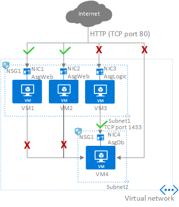

# Configure Network Security Groups (NSGs) and Application Security Groups (ASGs)

## Network security group

* A network security group is the main way of restricting unnecessary traffic, by filtering network traffic to and from Azure resources (Filtering can also be done on the [Virtual Network](10-Secure%20the%20connectivity%20of%20virtual%20networks%20(VPN%20authentication,%20Express%20Route%20encryption).md) level)
* A network security group contains security rules, describing allowed and denied communication to and from network interfaces and subnets.
* Security rules have the following properties:
   * Priority - between 100 and 4096
   * Protocol - TCP, UDP, ICMP, ESP, AH, or Any
   * Source and Destination - Any; an individual IP address; CIDR block (10.0.0.0/24, for example); service tag; or application security group
   * Source and Destination port ranges
   * Direction - incoming or outgoing
   * Action - allow or deny
* Security rules are evaluated in priority order (lowest number = highest priority)

Figure: Restricting traffic to internet and between servers

## Application security group

* Application security groups are used to group and name VMs and network interfaces, to simplify security rules and to avoid using IP-adresses in security rules.

1. Create the application security group "Asg007"
1. Create the network interface
1. Create the VM
1. Select the VM -> Networking -> Application Security Group -> "Asg007"

Figure: Using application security groups to allow and deny access to virtual machines

The following rules are needed to complete the scenario in the figure above, in priority order:
1. Allow traffic from Internet to AsgWeb
1. Allow traffic from AsgLogic to AsgDb
1. Deny all traffic to AsgDb

[Return to Implement platform protection](README.md)

[Return to Table of Contents](../README.md)