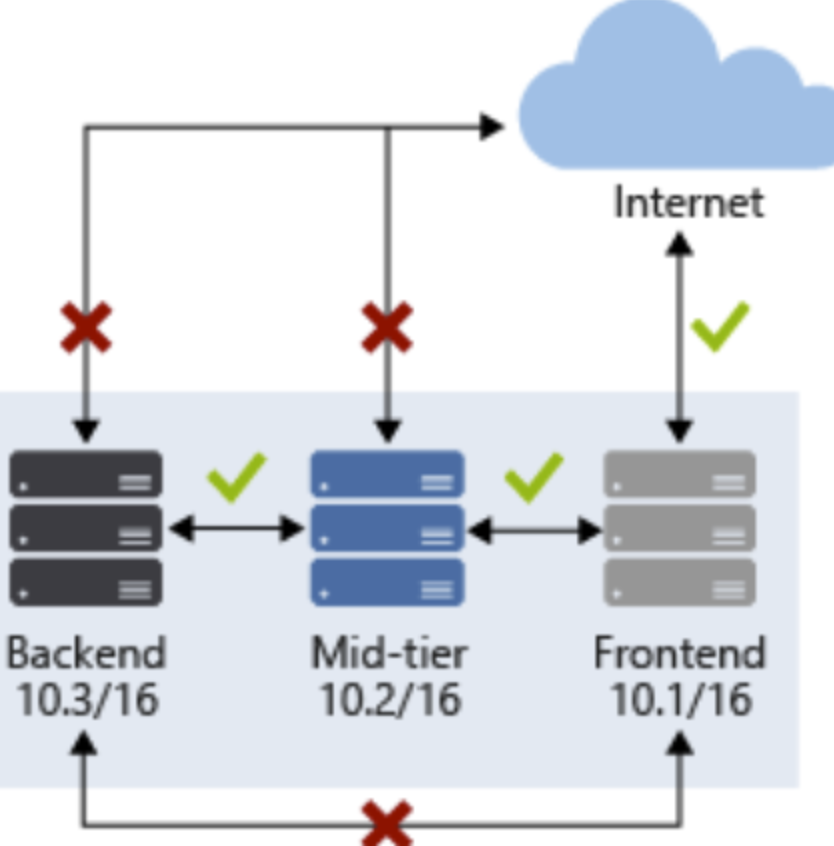

# Secure the connectivity of virtual networks

(Previously headline: "Configure Network Security Groups (NSGs) and Application Security Groups (ASGs)")

Learn: [Describe Azure Network Security groups](https://docs.microsoft.com/en-us/learn/modules/describe-basic-security-capabilities-azure/2-describe-azure-network-security-groups)

[Network security groups overview](https://docs.microsoft.com/en-us/azure/virtual-network/network-security-groups-overview)

## Network security group

* A network security group is the main way of restricting unnecessary traffic within a subnet in Azure, by filtering network traffic to and from Azure resources (Filtering can also be done on [Hybrid Networks](10-Secure%20the%20connectivity%20of%20virtual%20networks%20(VPN%20authentication,%20Express%20Route%20encryption).md))
* A network security group is always associated with one or more subnets or one or more network interfaces
* A network security group contains security rules, describing allowed and denied communication to and from network interfaces and subnets.
* Security rules have the following properties:
   * Name
   * Priority - between 100 and 4096
   * Protocol - TCP, UDP, ICMP, ESP, AH, or Any
   * Source and Destination - Any; an individual IP address; CIDR block (10.0.0.0/24, for example); service tag; or application security group
   * Source and Destination port ranges
   * Direction - incoming or outgoing
   * Action - allow or deny
* Security rules are evaluated in priority order (lowest number = highest priority)
* Processing of rules stop as soon as a matching rule (either Deny or Allow) is found
* NSGs are stateful: If inbound traffic is allowed, then outbound traffic is automatically allowed
* Security rules can not allow/ deny traffic to domain names!

## Default rules

(Default rules have low priority: >= 65000)

* Allow all traffic between VMs within the subnet
* Allow ingoing traffic from the default load balancer
* Deny ingoing traffic from any external source to any VMs
* Allow outgoing traffic from VMs to the internet
* Deny traffic that goes out of the VNet

## Service tags

* Microsoft manages specific tags called "Service tags" than can be used in network security group rules:
   * "VirtualNetwork": Represents all virtual network addresses in Azure in your on-premise network if using hybrid connectivity
   * "Internet"
   * "AzureTrafficManager"
   * "Storage"
   * "SQL"

Figure: Restricting traffic to internet and between servers

## Application security group

* Application security groups are used to group and name VMs and network interfaces logically, to simplify security rules and to avoid using IP-adresses in security rules.

1. Create the application security group "Asg007"
1. Create the network interface
1. Create the VM
1. Select the VM -> Networking -> Application Security Group -> "Asg007"

Figure: Using application security groups to allow and deny access to virtual machines and network interfaces (nic's)

The following rules are needed to complete the scenario in the figure above, in priority order:
1. Allow traffic from Internet to AsgWeb
1. Allow traffic from AsgLogic to AsgDb
1. Deny all traffic to AsgDb

[Return to Implement platform protection](README.md)

[Return to Table of Contents](../README.md)