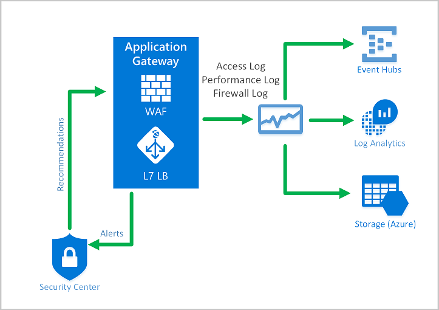

# Configure a Web Application Firewall (WAF) on Azure Application Gateway

* About [Application Gateway](https://docs.microsoft.com/en-us/azure/application-gateway/overview))
   * The basic Application Gateway is a load balancer. It uses application layer load balancing (basing routing decisions on HTTP request properties), for example routing all requests for /images to a server pool for images, and /videos to a server pool for videos. 
* The Application Gateway have different tiers:
   1. Standard
   1. Standard V2: Autoscaling; Zone redundancy (App instances can be deployed to different zones); Key vault integration; Kubernetes Service ingress controller
   1. WAF
   1. WAF V2
* Web Application Firewall provides protection against SQL injection, XSS, and many other exploits
* WAF on Application Gateway is based on [OWASP Core Rule Set (CRS)](https://owasp.org/www-project-modsecurity-core-rule-set/)
* Protects only HTTP-based resources (hence the name: *Web Application* Firewall)
* WAF modes:
   * Detection mode (log only)
   * Prevension mode (block requests). Attackers receive a 403 Unauthorized Access, and the request is logged
      * Traditional mode (rules are evaluated independently)
      * Anomality Scoring mode (Rules have score, and a request is only blocked if the score >= 5). Default for CRS version 3.x

## Benefits of WAF on Application Gateway

* Application Gateway can host up to 40 websites, and all will be protected by the WAF
* Possible to create custom policies for each site
* Monitor attacks using real time WAF log, integrated into [Azure Monitor](../3-Manage%20security%20operations/README.md#monitor-security-by-using-azure-monitor)
* WAF is also integrated in [Security Center](../3-Manage%20security%20operations/README.md#monitor-security-by-using-azure-security-center)

## Policies and rules

* A policy is a collection of managed rules, custom rules and exceptions
   * See example of [managed rules for SQL injection](https://github.com/coreruleset/coreruleset/blob/v3.4/dev/rules/REQUEST-942-APPLICATION-ATTACK-SQLI.conf)
* Policies on an Application Gateway exist on a global, per-site or per-url level.
* Custom rules are processed first
* A rule consits of:
   * A match condition
   * A priority (Unique integer - small number have higher priority)
   * An action (ALLOW/ BLOCK/ LOG)

TODO: [Create an application gateway with a Web Application Firewall](https://docs.microsoft.com/en-us/azure/web-application-firewall/ag/application-gateway-web-application-firewall-portal)

Figure: WAF Monitoring, with Security Center and Azure Monitor

[Return to Implement platform protection](README.md)

[Return to Table of Contents](../README.md)