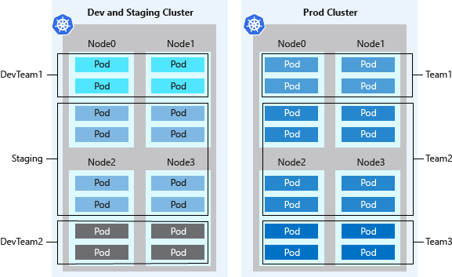

# Configure isolation for AKS

* Isolation for AKS: The ability to deploy Kubernetes Cluster on isolated virtual machines
* Creating an Kubernetes Cluster also creates a Service Principal
   * The Service Principal needs to be granted the push and pull roles to read and pull images from the Azure Container Registry.
* [Enhance security in the AKS cluster with AD integration](https://docs.microsoft.com/en-us/azure/aks/concepts-identity#azure-ad-integration)

## Design clusters for multi-tenancy

* Teams and workloads (environments) can be logically isolated in the same cluster
* Logical isolation: A Kubernetes [Namespace](https://docs.microsoft.com/en-us/azure/aks/concepts-clusters-workloads#namespaces) creates a logical isolation boundary

Figure: Namespaces logically group resources such as pods and deployments, to divide the AKS cluster and restrict access to the resources

* Physical isolation: Create a cluster for each team/ environment.
   * Use for example in a multi tenant scenario where not all tenants can be trusted, since multiple tenants are working on a shared common infrastructure.

## Application Gateway Ingress Controller

[What is Application Gateway Ingress Controller?](https://docs.microsoft.com/en-us/azure/application-gateway/ingress-controller-overview)

* The Application Gateway Ingress Controller (AGIC) is a Kubernetes application that makes it possible to for AKS to use the Application Gateway.
* Provides TSL and WAF functionality to the AKS Cluster
* Eliminates the need for an other load balancer/ public IP in front of the cluster.
* Improves performance

 

[Return to Implement platform protection](README.md)

[Return to Table of Contents](../README.md)