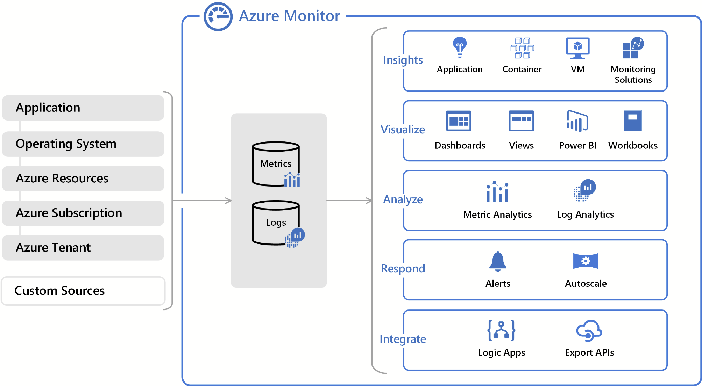

# Comparing Azure Monitor, Azure Security Center and Azure Sentinel

[Azure Sentinel, Azure Monitor, Azure Security Center and Log Analytics Relations](https://www.eshlomo.us/azure-security-sentinel-monitor-relation/)

## Log Analytics

* A huge logging platform that can collect records from multiple log sources regardless of physical location, including workloads, services and servers.
* Provides users with the ability to query, analyze and correlate logs.
   * Uses custom query language.
* Backbone of all other monitoring services

## Azure Monitor

* Complete solution for collecting, analyzing and acting on telemetry from Azure, other cloud providers and on-premise environments.
* Components
   * Alerting
   * Action Groups
   * Action Rules
* Features:
   * Application Insights, VM Insights, Container Insights
   * Create smart alerts
   * Automate actions
      * Azure Function
      * Azure Logic Apps
      * ...
   * Azure dashboards and workbooks can create visualizations

### Azure Monitor Sources

[Sources of monitoring data for Azure Monitor](https://docs.microsoft.com/en-us/azure/azure-monitor/agents/data-sources)

* Application
   * Application Insights
* Operating System
* Azure Resources
   * Metrics
   * Resource logs - Insights into internal operation of a resource
* Azure Subscription
   * Service Health
   * Activity Log - Health records along with configuration changes made to subscription resources
* Azure Tenant - Data from tenant level servicec, such as Active Directory
* Custom sources

### Monitoring agent

[Azure Monitor agent overview](https://docs.microsoft.com/en-us/azure/azure-monitor/agents/azure-monitor-agent-overview)

* Collects logs from guest operating system of VMs, and feeds them to Azure Monitor or Log Analytics.
   * Performance data (Destinations: both Azure Monitor and Log Analytics)
   * Windows Event logs (Windows) and Syslogs (Linux) (Destination: Log Analytics)
* Centrally configured
* Set up Data Collection Rules (DCR) to configure data collection from each agent.
   * Rules can be defined once, and resued by many agents.
* Replaces Log Analytics agent, Diagnostics extensions and Telegraf agent.
* Monitoring agent can be automatically installed on new and existing VMs by activating the uto provisioning extension "Log Analytics agent for Azure VMs" in Azure Securiy Center. [Reference](https://docs.microsoft.com/en-us/azure/security-center/security-center-enable-data-collection#why-use-auto-provisioning)

# Azure Security Center

* Provides insight into the security state across your cloud
* Features:
   * Threat analysis
   * Provides security recommendations and remediation actions
   * Compliance audits

[Return to Manage security operations](README.md)

[Return to Table of Contents](../README.md)