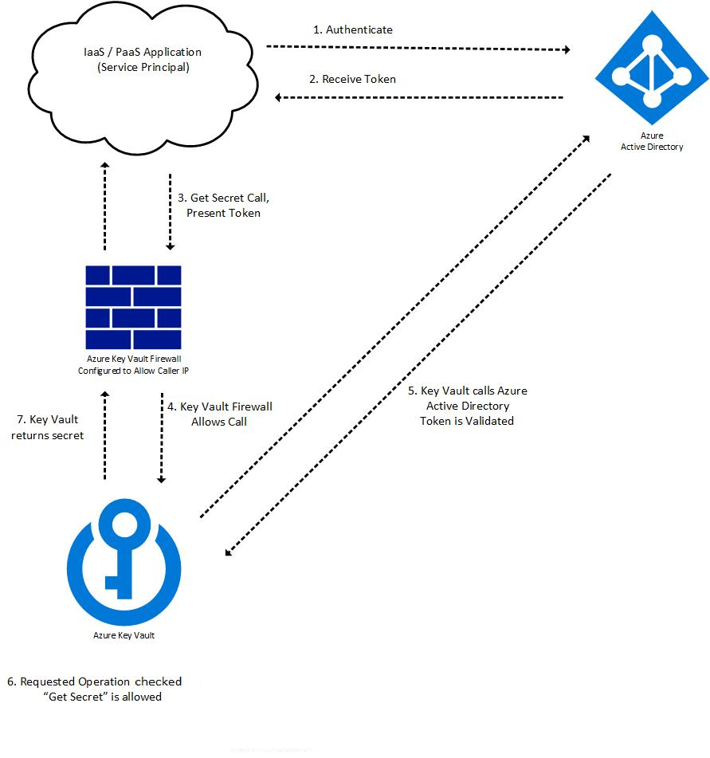

# Manage access to Key Vault

## Network security

* Network connectivity can be configured when creating the key vault, and a firewall will be added:
   * Public endpoints (all networks)
   * Public endpoints (selected VNets, se below)
   * Private endpoint (use a private IP from an Azure VNet to access the key vault)
   * Can optionally also allow trusted Microsoft services to be able to bypass the firewall (Azure backup, Azure Storage etc)
* Create a Virtual Network Service Endpoint for Azure Key Vault, to limit access to the key vault for a specific VNet [Implement Service Endpoints](../2-Implement%20platform%20protection/18-Implement%20Service%20Endpoints.md)
* IP-address: Limit exposure to key vault by IP-address

## Identity management

[How an application access the key vault](https://docs.microsoft.com/en-us/azure/key-vault/general/authentication#the-key-vault-request-operation-flow-with-authentication):
1. App authenticates with Azure AD
1. Azure Ad issues an authentication token
1. Application access Key Vault, using token
1. Key Vault validates token by asking Azure AD
1. Key vault returns secret

## Three ways for an applicatoion to access the key vault (all three requires Azure AD):
* Application-only
   * The application represents service principal or managed identity
   * _objectid_ for the application must be specified in the access policy (_applicationid_ must *not* be specified)
* User-only
   * User accesses key vault from app registered in the tenant, for example Azure portal or Azure powershell.
   * _objectid_ for the application must be specified in the access policy (_applicationid_ must *not* be specified)
* Application-plus-user (compound identity)
   * The user is required to access the key vault from a specific application and the application must use the on-behalf-of authentication (OBO) flow to impersonate the user. 
   * Both _objectid_ (representing the user) and _applicationid_ (representing the application) must be specified in the access policy

[Return to Secure data and applications](README.md)

[Return to Table of Contents](../README.md)